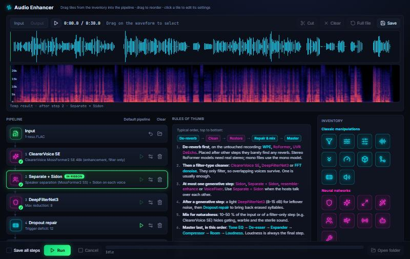

# audio-enhancer

Restores low-quality smartphone podcast recordings to clean, full-band speech. Its character is tunable, and a fast 3-minute snippet loop lets you find the right sound before processing a whole episode. It is built only from free, open-source models and runs on a 6 GB consumer GPU.

```bash
# 1) audition: render a 3-minute section in several flavours (loudness-matched, with the untouched original)
./enhance.sh raw/episode.mp3 --start 10:00 --preset clean,natural,warm,denoise --include-original

# 2) fine-tune on the same section; model stages are cached, so each render takes ~10-20 s
./enhance.sh raw/episode.mp3 --start 10:00 --preset natural --mix 30 --set orig_source=raw --name mix30_raw

# 3) render the whole episode with the chosen settings
./enhance.sh raw/episode.mp3 --preset natural --mix 30 --set orig_source=raw
```

Outputs go to `out/<file>/<section>/<name>.wav` (48 kHz / 24-bit stereo, -16 LUFS) and `.mp3` (192 kbps, source tags and cover art copied). A `.json` file next to each output records the exact settings used.

A 66-minute episode takes about 5 minutes on an RTX 4050 Laptop GPU.

Prefer a visual workflow? The [control panel](#control-panel) builds and runs the same pipelines with drag-and-drop tiles, a waveform + spectrogram view and step-by-step previews.


*Top: the original, a smartphone recording at 68 kbps MP3. Its band ends around 10 kHz and the MP3 encoding left holes above 5 kHz. Bottom: the enhanced output, full band to 20+ kHz with clean, continuous voice harmonics.*

## Pipeline

| Stage | Tool | What it does |
|---|---|---|
| 1 | [**Sidon**](https://github.com/sarulab-speech/Sidon) (`sarulab-speech/sidon-v0.1`) | Generative speech restoration. A multilingual w2v-BERT 2.0 feature predictor plus a vocoder rebuilds clean 48 kHz speech: it removes noise, reverb and codec artifacts and extends the bandwidth. |
| 2 | [**DeepFilterNet3**](https://github.com/Rikorose/DeepFilterNet) (`dfn_atten`) | Removes the faint residual noise Sidon leaves in pauses. |
| 3 | Dropout repair (`repair_db`) | Sidon sometimes erases quiet syllables, or a plosive and vowel onset under overlapping speech. Wherever its speech level falls far below the original's, the output crossfades to the EQ-matched, lightly denoised original. Patches closer than 250 ms are merged. Manual fix ranges from `fixes.json` are applied here too. |
| 4 | Original mix (`orig_mix`, `orig_source`) | A percentage of the original (raw, or lightly denoised) mixed under the enhanced voice, level-matched. It keeps room tone continuous so Sidon's between-phrase gating isn't heard, softens warble on overlapping voices and adds natural texture. |
| 5 | Tone and dynamics (ffmpeg) | 80 Hz high-pass, EQ (warmth / mud / mid / presence / air), de-esser, optional expander, levelling compressor. |
| 6 | Room (`room_db`, `room_rt60`) | Optional synthetic stereo small-room reverb, for space and width. |
| 7 | Loudness | Two-pass linear loudness normalisation to -16 LUFS / -1.5 dBTP. |

Long files are processed in 30 s (Sidon) and 90 s (DeepFilterNet) segments with a 1 s sin²/cos² crossfade, streamed to disk. VRAM peaks at about 2.2 GB and memory use stays flat.

## Control panel



A local web UI for building, auditioning and running pipelines visually. Start it by double-clicking `panel.bat`, or run:

```bash
.venv/Scripts/python.exe panel/server.py      # then open http://127.0.0.1:8765
```

**Ribbons:** the top of the page shows the audio twice, with the same time axis, playhead and selection.
- The **waveform** and the **spectrogram** (0 to 20+ kHz, rendered on the server, so even hour-long files load fast). The spectrogram makes it easy to see what a step did, e.g. the high frequencies Sidon rebuilds.
- Drag on either ribbon to select. A single click outside the selection cancels it; a click inside it only moves the playhead.
- **Cut** makes the selection the working input, a quick way to tune on a 3-minute snippet; **Full file** goes back.
- **Save** writes the selection, or the whole shown audio, as WAV / FLAC / MP3.
- **Input / Output** switches between the original and the last full run's result.

**Pipeline:** a vertical chain of tiles, starting with the fixed **Input** tile.
- Click the Input tile to choose a file; its ↶ button brings the original input back into the ribbons.
- Drag steps in from the **inventory** (classic manipulations in cyan, neural networks in magenta; hover an icon for its full name).
- Drag tiles to reorder them, use the bin icon to remove one, and the gear icon to edit its settings.
- **Mix** can blend with the input or any earlier step, e.g. 50 % of a filter-only step under a generative one.

**Run to any step:** every tile has a ▶ button that runs the pipeline up to and including that step.
- The step's result is shown in the ribbons as a temporary result; nothing is written to `out/`.
- Steps that already have a result get a ✓, and their ▶ is greyed out. Click such a tile to show its result again.
- The tile shown in the ribbons is highlighted (**IN RIBBON**).
- Results stay valid only while nothing changes. Editing a step's settings, reordering, deleting, or changing the input re-activates the ▶ of the affected steps.
- If the result in the ribbons became invalid, playback stops and the ribbons fall back to the last still-valid step, or to the input.

**Full run:**
- **Run** processes the whole pipeline. With **Save all steps** ticked, every intermediate result is written as well as `final.wav` / `final.mp3`.
- Output goes to `out/panel/<file>/<timestamp>/`. The progress bar shows the running step, and **Open folder** opens the result.
- The pipeline is locked while a run is in progress (**Cancel** to edit).

**Caching:** step results are cached in `cache/panel/`, keyed by the input section, the steps before them and all their settings. Changing a later step re-runs only from that step on.

**Help:** the middle column has two cards.
- **Rules of thumb** gives the recommended step order: de-reverb → clean → restore → repair & mix → master.
- **Active step** explains the tile you last clicked, ran or added: what the step does and where it belongs in the chain. It also lists every setting with its current value, default, recommended range and what changing it does to the sound. The texts are in [panel/help.py](panel/help.py).

**Default pipeline:** ClearerVoice SE → Separate + Sidon → DeepFilterNet3 → Dropout repair → Mix 50 % with step 1 → Tone EQ → De-esser → Compressor → Room → Loudness.

The ClearerVoice, Separate + Sidon, RoFormer / UVR, resemble-enhance and VoiceFixer steps need the extra environments from `./setup.sh --all`.

## Presets and parameters

| Preset | Character |
|---|---|
| `clean` | sharpest and driest, with silent pauses (the original v1 chain) |
| `natural` | some room tone, 10% of the original mixed in, a light stereo room, softer highs, gentler levelling |
| `warm` | fuller low end, rounder highs, more radio-like levelling |
| `denoise` | no generative model: denoised original plus mastering (most authentic, least improved) |

Override any parameter with `--set key=value`; `--mix N` is a shortcut for `orig_mix`. `./enhance.sh --help` lists them all: `repair_db`, `dfn_atten`, `orig_mix`, `orig_source`, `warmth_db`, `mud_db`, `mid_db`, `presence_db`, `air_db`, `deess`, `expander_db`, `comp_ratio`, `comp_thresh_db`, `room_db`, `room_rt60`, `lufs`.

**Manual fixes.** If you hear an artifact the automatic repair missed, mark it while auditioning a snippet:

```bash
./enhance.sh raw/episode.mp3 --start 10:00 --preset natural --fix 0:40-0:42@0.6
```

The time is relative to the snippet; `@0.6` means a 60% fallback to the original. The range is stored in absolute file time in `fixes.json`, and every later render of that file applies it, including the full one. `--clear-fixes` removes a file's stored ranges.

## How the chain was chosen

Candidates were run on two 60 s excerpts of a real episode: two speakers in a living room, recorded on a phone, 68 kbps MP3. Each was scored with [DNSMOS P.835](https://github.com/microsoft/DNS-Challenge) (SIG/BAK/OVRL) and [UTMOS22](https://github.com/tarepan/SpeechMOS). Higher is better on both.

| Candidate | DNSMOS OVRL (clip 1 / 2) | UTMOS (clip 1 / 2) |
|---|---|---|
| Original | 2.92 / 2.86 | 1.38 / 1.39 |
| Classic DSP (EQ + FFT denoise + compressor) | 2.61 / 2.83 | 1.35 / 1.36 |
| DeepFilterNet3 (limit 12 dB) | 3.03 / 3.08 | 1.46 / 1.46 |
| ClearerVoice MossFormer2 SE 48k | 2.96 / – | 1.41 / – |
| ClearerVoice SE 48k → SR 48k | 2.82 / 2.87 | 1.31 / 1.32 |
| VoiceFixer mode 0 | 3.16 / 3.37 | 1.80 / 1.92 |
| resemble-enhance (λ = 0.9) | **3.39** / 3.38 | 2.07 / 2.10 |
| Sidon | 3.32 / 3.44 | 2.38 / **2.60** |
| **Sidon → DeepFilterNet3 (15 dB)** | 3.32 / **3.47** | **2.40** / 2.59 |
| Final, after mastering | 3.23 / 3.46 | 2.28 / 2.55 |

- **Sidon → DeepFilterNet3** won on quality, pause noise floor (about -60 dB below speech) and speed.
- **resemble-enhance** came a close second, but its enhancer needs more than 6 GB of VRAM and would take about 5 hours for a 66-minute episode.
- **Mastering** costs a little DNSMOS: levelling brings the room tone up slightly. That trade-off is intentional, for even loudness between the two speakers.

The improvement held on three held-out excerpts of the full episode (OVRL 2.66–2.83 → 3.15–3.33, UTMOS 1.35–1.40 → 2.14–2.33). The metrics are proxies, so listen to the result.


## Setup

Requirements:
- An NVIDIA GPU with CUDA. The released Sidon weights are CUDA TorchScript.
- [uv](https://docs.astral.sh/uv/).
- bash (Git Bash on Windows).

```bash
./setup.sh          # .venv (ffmpeg, evaluation, control panel), envs/sidon, envs/dfn
./setup.sh --all    # also envs/clearvoice, envs/sep (RoFormer / UVR), envs/resemble, envs/vf
```

Each tool gets its own Python 3.11 venv with PyTorch 2.5.1 + CUDA 12.4, because their dependency pins conflict. Model weights download from Hugging Face into `models/` on first run.

ffmpeg is taken from `$FFMPEG`, else from `PATH`, else from the `imageio-ffmpeg` binary installed in `.venv`.

## Repository layout

```
enhance.py                 the pipeline: presets, parameters, snippet cache, dropout repair, original mix, fixes
enhance.sh                 wrapper that runs enhance.py with the .venv python
panel.bat                  starts the control panel (panel/server.py) and opens it in the browser
panel/
  server.py                Flask API: file dialogs, waveform peaks, spectrograms, cut/save, run / run-to-step, progress
  engine.py                step registry (classic + neural), cached step execution, progress parsing
  help.py                  explanations of every step and setting shown in the panel
  static/                  the UI (index.html, app.js, style.css; wavesurfer.js and Lucide icons from CDN)
setup.sh                   environment setup
scripts/
  sidon_enhance.py         Sidon restoration, segmented
  dfn_enhance.py           DeepFilterNet3, segmented
  separate.py              2-speaker separation (ClearerVoice MossFormer2 SS), level-consistent, speaker order tracked
  wpe_run.py               WPE dereverberation (classical), segmented, keeps stereo
  segproc.py               shared segment + crossfade streaming helper
  common.sh                repo root / python / ffmpeg resolution
eval/
  score.py                 DNSMOS P.835 + UTMOS22 + effective bandwidth   (.venv)
  floor.py                 pause noise floor relative to speech level
  dropouts.py              finds spans where an enhanced file lost speech present in the original
  stats.py                 loudness, octave balance, noise-floor spectrum
  spec.py                  stacked comparison spectrograms
experiments/               runners for the tools that lost the comparison
  resemble_run.py          resemble-enhance on Windows (deepspeed stubbed, weights via huggingface_hub)
  clearvoice_run.py        ClearerVoice-Studio MossFormer2 SE/SR chains (fixed-length SR padding for speed)
  voicefixer_run.py        VoiceFixer
```

Example evaluation:

```bash
.venv/Scripts/python.exe eval/score.py original.wav "original - enhanced.wav"
```

## Notes and limitations

- **Generative restoration:** Sidon rebuilds the voice rather than filtering it.
  - **Dropouts:** it can drop quiet syllables. The automatic dropout repair catches these; check the result with `eval/dropouts.py`.
  - **Overlapping voices:** when both hosts talk at once, it can warble or gate between phrases. `orig_mix` (20–40%) and manual `--fix` ranges are the remedies.
- **Recording tips:** the cleanest gains come from recording closer (30–50 cm, or one phone per host) in an uncompressed format (WAV or FLAC, with in-app "enhance", noise reduction and automatic gain turned off).
- **No studio miracles:** a phone in a living room becomes clean, full and even. It does not become a large-diaphragm condenser in a treated booth.
- **Mono voice:** the voice is mono, because the source recordings were effectively mono. Stereo width comes only from the optional synthetic room.
- **GPU sharing:** don't run several GPU models at once on a 6 GB card. Contention made runs 10–50× slower.
- **Windows workarounds in the experiment scripts:**
  - resemble-enhance: `deepspeed` is stubbed (training only), and `PosixPath` is mapped to `WindowsPath` so its `hparams.yaml` loads.
  - clearvoice 0.1.2: a batch-size-1 bug in the SR decoder is patched by `setup.sh --all`.

## Credits

[Sidon](https://github.com/sarulab-speech/Sidon) (sarulab-speech) ·
[DeepFilterNet](https://github.com/Rikorose/DeepFilterNet) ·
[resemble-enhance](https://github.com/resemble-ai/resemble-enhance) ·
[ClearerVoice-Studio](https://github.com/modelscope/ClearerVoice-Studio) ·
[VoiceFixer](https://github.com/haoheliu/voicefixer) ·
[DNSMOS](https://github.com/microsoft/DNS-Challenge) ·
[SpeechMOS / UTMOS22](https://github.com/tarepan/SpeechMOS) ·
[python-audio-separator](https://github.com/nomadkaraoke/python-audio-separator) with the MelBand RoFormer de-reverb models by anvuew and the UVR models ·
[nara_wpe](https://github.com/fgnt/nara_wpe) ·
[wavesurfer.js](https://wavesurfer.xyz/) ·
[Lucide](https://lucide.dev/) icons ·
[Flask](https://flask.palletsprojects.com/) ·
[FFmpeg](https://ffmpeg.org/).

Each model is subject to its own license; check the linked repositories before commercial use.
