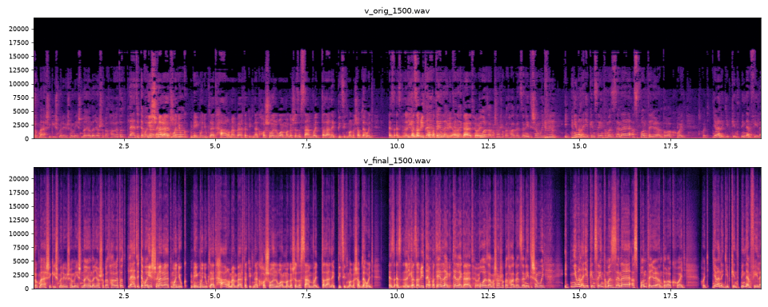
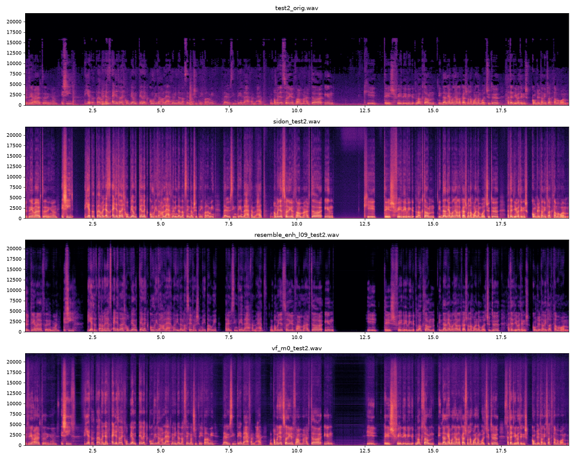

# audio-enhancer

Restores low-quality smartphone podcast recordings to clean, full-band speech. It is a one-command pipeline built only from free, open-source models, and runs on a 6 GB consumer GPU.

```bash
./enhance.sh "episode.mp3"
# -> "episode - enhanced.wav"  (48 kHz / 24-bit stereo, -16 LUFS)
# -> "episode - enhanced.mp3"  (192 kbps, original ID3 tags + cover art copied)
```

A 66-minute episode takes about 5 minutes on an RTX 4050 Laptop GPU.



*Top: the original, a smartphone recording at 68 kbps MP3. Its band ends around 10 kHz and the MP3 encoding left holes above 5 kHz. Bottom: the enhanced output, full band to 20+ kHz with clean, continuous voice harmonics.*

## Pipeline

| Stage | Tool | What it does |
|---|---|---|
| 1 | [**Sidon**](https://github.com/sarulab-speech/Sidon) (`sarulab-speech/sidon-v0.1`) | Generative speech restoration. A multilingual w2v-BERT 2.0 feature predictor plus a vocoder rebuilds clean 48 kHz speech: it removes noise, reverb and codec artifacts and extends the bandwidth. |
| 2 | [**DeepFilterNet3**](https://github.com/Rikorose/DeepFilterNet), attenuation limit 15 dB | Removes the faint residual noise Sidon leaves in pauses. |
| 3 | ffmpeg mastering ([scripts/master.sh](scripts/master.sh)) | 80 Hz high-pass, tonal EQ (less boxiness, more presence and air), de-esser, soft downward expander, gentle 2:1 levelling compressor, two-pass linear loudness normalisation to -16 LUFS / -1.5 dBTP. |

Long files are processed in 30 s (Sidon) and 90 s (DeepFilterNet) segments with a 1 s sin²/cos² crossfade, streamed to disk. VRAM peaks at about 2.2 GB and memory use stays flat.

## How the chain was chosen

Candidates were run on two 60 s excerpts of a real episode: two speakers in a living room, recorded on a phone, 68 kbps MP3. Each was scored with [DNSMOS P.835](https://github.com/microsoft/DNS-Challenge) (SIG/BAK/OVRL) and [UTMOS22](https://github.com/tarepan/SpeechMOS). Higher is better on both.

| Candidate | DNSMOS OVRL (clip 1 / 2) | UTMOS (clip 1 / 2) |
|---|---|---|
| Original | 2.92 / 2.86 | 1.38 / 1.39 |
| Classic DSP (EQ + FFT denoise + compressor) | 2.61 / 2.83 | 1.35 / 1.36 |
| DeepFilterNet3 (limit 12 dB) | 3.03 / 3.08 | 1.46 / 1.46 |
| ClearerVoice MossFormer2 SE 48k | 2.96 / – | 1.41 / – |
| ClearerVoice SE 48k → SR 48k | 2.82 / 2.87 | 1.31 / 1.32 |
| VoiceFixer mode 0 | 3.16 / 3.37 | 1.80 / 1.92 |
| resemble-enhance (λ = 0.9) | **3.39** / 3.38 | 2.07 / 2.10 |
| Sidon | 3.32 / 3.44 | 2.38 / **2.60** |
| **Sidon → DeepFilterNet3 (15 dB)** | 3.32 / **3.47** | **2.40** / 2.59 |
| Final, after mastering | 3.23 / 3.46 | 2.28 / 2.55 |

- **Sidon → DeepFilterNet3** won on quality, pause noise floor (about -60 dB below speech) and speed.
- **resemble-enhance** came a close second, but its enhancer needs more than 6 GB of VRAM and would take about 5 hours for a 66-minute episode.
- **Mastering** costs a little DNSMOS: levelling brings the room tone up slightly. That trade-off is intentional, for even loudness between the two speakers.

The improvement held on three held-out excerpts of the full episode (OVRL 2.66–2.83 → 3.15–3.33, UTMOS 1.35–1.40 → 2.14–2.33). The metrics are proxies, so listen to the result.



## Setup

Requirements:
- An NVIDIA GPU with CUDA. The released Sidon weights are CUDA TorchScript.
- [uv](https://docs.astral.sh/uv/).
- bash (Git Bash on Windows).

```bash
./setup.sh          # .venv (ffmpeg + evaluation tools), envs/sidon, envs/dfn
./setup.sh --all    # also envs/resemble, envs/clearvoice, envs/vf for the comparison scripts
```

Each tool gets its own Python 3.11 venv with PyTorch 2.5.1 + CUDA 12.4, because their dependency pins conflict. Model weights download from Hugging Face into `models/` on first run.

ffmpeg is taken from `$FFMPEG`, else from `PATH`, else from the `imageio-ffmpeg` binary installed in `.venv`.

## Repository layout

```
enhance.sh                 one-command pipeline (accepts several files)
setup.sh                   environment setup
scripts/
  sidon_enhance.py         Sidon restoration, segmented
  dfn_enhance.py           DeepFilterNet3, segmented
  segproc.py               shared segment + crossfade streaming helper
  master.sh                ffmpeg mastering chain
  common.sh                repo root / python / ffmpeg resolution
eval/
  score.py                 DNSMOS P.835 + UTMOS22 + effective bandwidth   (.venv)
  floor.py                 pause noise floor relative to speech level
  stats.py                 loudness, octave balance, noise-floor spectrum
  spec.py                  stacked comparison spectrograms
experiments/               runners for the tools that lost the comparison
  resemble_run.py          resemble-enhance on Windows (deepspeed stubbed, weights via huggingface_hub)
  clearvoice_run.py        ClearerVoice-Studio MossFormer2 SE/SR chains (fixed-length SR padding for speed)
  voicefixer_run.py        VoiceFixer
```

Example evaluation:

```bash
.venv/Scripts/python.exe eval/score.py original.wav "original - enhanced.wav"
```

## Notes and limitations

- **Generative restoration:** Sidon rebuilds the voice rather than filtering it. It is robust, but it can occasionally soften a consonant or add a slightly metallic timbre, mostly in overlapping speech or laughter. If that happens, `experiments/resemble_run.py --mode enhance --lambd 0.9` is the best alternative.
- **No studio miracles:** a phone in a living room becomes clean, full and even. It does not become a large-diaphragm condenser in a treated booth.
- **Mono output:** the output is dual-mono, because the source recordings were effectively mono (L/R correlation 0.999).
- **GPU sharing:** don't run several GPU models at once on a 6 GB card. Contention made runs 10–50× slower.
- **Windows workarounds in the experiment scripts:**
  - resemble-enhance: `deepspeed` is stubbed (training only), and `PosixPath` is mapped to `WindowsPath` so its `hparams.yaml` loads.
  - clearvoice 0.1.2: a batch-size-1 bug in the SR decoder is patched by `setup.sh --all`.

## Credits

[Sidon](https://github.com/sarulab-speech/Sidon) (sarulab-speech) ·
[DeepFilterNet](https://github.com/Rikorose/DeepFilterNet) ·
[resemble-enhance](https://github.com/resemble-ai/resemble-enhance) ·
[ClearerVoice-Studio](https://github.com/modelscope/ClearerVoice-Studio) ·
[VoiceFixer](https://github.com/haoheliu/voicefixer) ·
[DNSMOS](https://github.com/microsoft/DNS-Challenge) ·
[SpeechMOS / UTMOS22](https://github.com/tarepan/SpeechMOS) ·
[FFmpeg](https://ffmpeg.org/).

Each model is subject to its own license; check the linked repositories before commercial use.
